## About me
  
학구열이 불타오르고 있는 연구자입니다.  
우매함의 봉우리에서 내려가고 있습니다.  

## Tech Stacks
|Category|Tech|
|--------|----|
|Language|      |
|DevOps|    |
|Server| |
|AI & ML| |
|ETC||

## Projects
|Name|Position|Duration|Description|
|----|--------|--------|-----------|
|연구|Caching Policy|2025-08-18 ~ **Present**|연구실|
|MDC|코드 수정 및 매뉴얼 작성|2025-03-25 ~ 2025-08-17|연구실|
|냠코치|Server|2025-06-28 ~ 2025-08-21|KUIT5|

## Activites
|Name|Position|Duration|Description|
|----|--------|--------|-----------|
|[CoinLab](http://coin.konkuk.ac.kr)|학부연구생|2025-03-25 ~ **Present**|건국대학교 연구실|
|[KUIT](https://github.com/Konkuk-KUIT)|부원|2025-03-19 ~ 2025-08-21|건국대학교 개발동아리|
|알콘|운영진|2025-03-11 ~ 2025-04-18|건국대학교 알고리즘동아리|
|알콘|부원|2023-09-14 ~ 2025-03-11|건국대학교 알고리즘동아리|
|비빔밥|부원|2022-03-21 ~ 2022-06-22|건국대학교 학술동아리|

## Participate
- 2024 ICPC 예선 참가
- 2024 건국대학교 프로그래밍 경진대회(KUPC): 6등
- 2023 ICPC 예선 참가
- 2023 건국대학교 프로그래밍 경진대회(KUPC) Division 2: 4등

## stats
  
  
  
  

## Contacts
언제든 연락주셔도 상관없습니다.  
| Platform     | Response Time        | Contact Info               |
|--------------|----------------------|----------------------------|
|       | ⚡ Instant          | assencial                  |
|     | 🟢 Within 1 hours   | dlstkdals123               |
|          | 🔵 Within 6 hours     | dlstkdals123@konkuk.ac.kr  |
